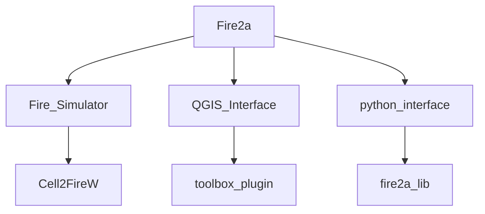

# About us
| Role | Where | Method |
| --- | --- | --- | 
| Outreach |  https://www.fire2a.com | fire2a@fire2a.com | 
| User docs |  https://fire2a.github.io/docs/ | github-issues "forum" |
| documentacion usuarios |  https://fire2a.github.io/documentacion/ | github-issues "forum" |
| Algorithms docs |  https://fire2a.github.io/fire2a-lib/ | Pull Requests |
| Developer docs |  https://www.github.com/fire2a | Pull Requests |

__1. [Cell2FireW](https://github.com/fire2a/C2F-W):__  
- WildFire Simulator  
- Command Line Interface  

__2. [Fire-ToolBox](https://github.com/fire2a/fire-analytics-qgis-processing-toolbox-plugin):__  
- Friendly interface for Cell2Fire + Optimization and Analytics tools, etc.  
- QGIS Interfaces (x5)  

__3. [Algorithms-libs](https://github.com/fire2a/fire2a-lib):__  
- Algorithms and common GIS tasks Python library

__4. [Documentation](https://github.com/fire2a/docs):__  
- All subjects except code

