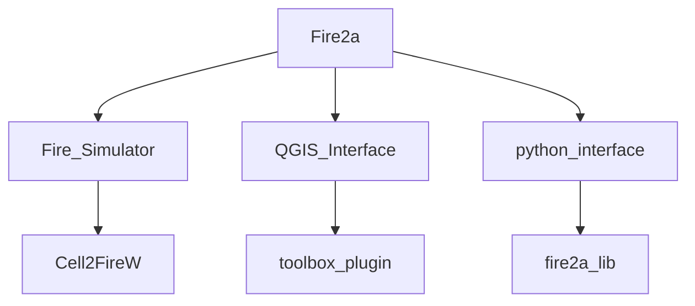
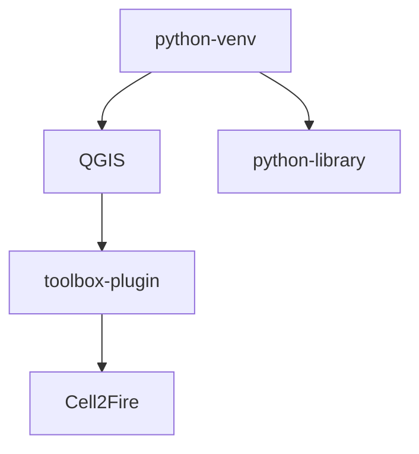

# About us
| Role | Where | Method |
| --- | --- | --- | 
| Outreach |  https://www.fire2a.com | fire2a@fire2a.com | 
| User docs |  https://fire2a.github.io/docs/ | github-issues "forum" |
| documentacion usuarios |  https://fire2a.github.io/documentacion/ | github-issues "forum" |
| Algorithms docs |  https://fire2a.github.io/fire2a-lib/ | Pull Requests |
| Developer docs |  https://www.github.com/fire2a | Pull Requests |

__1. [Cell2FireW](https://github.com/fire2a/C2F-W):__  
- WildFire Simulator  
- Command Line Interface  

__2. [Fire-ToolBox](https://github.com/fire2a/fire-analytics-qgis-processing-toolbox-plugin):__  
- Friendly interface for Cell2Fire + Optimization and Analytics tools, etc.  
- QGIS Interfaces (x5)  

__3. [Algorithms-libs](https://github.com/fire2a/fire2a-lib):__  
- Algorithms and common GIS tasks Python library

__4. [Documentation](https://github.com/fire2a/docs):__  
- All subjects except code



# Developer setup

1. get QGIS
2. get the repos
3. symlink them
4. run
## 1. Get latest qgis  
- steps from https://qgis.org/resources/installation-guide/#debianubuntu  
- check your distro version `$lsb_release -a`, below is for Debian 12 (bookworm)  
```bash
sudo apt install gnupg software-properties-common
sudo mkdir -m755 -p /etc/apt/keyrings  # not needed since apt version 2.4.0 like Debian 12 and Ubuntu 22 or newer
sudo wget -O /etc/apt/keyrings/qgis-archive-keyring.gpg https://download.qgis.org/downloads/qgis-archive-keyring.gpg
# is the suite bookworm ?
echo 'Types: deb deb-src
URIs: https://qgis.org/debian
Suites: bookworm
Architectures: amd64
Components: main
Signed-By: /etc/apt/keyrings/qgis-archive-keyring.gpg' | sudo tee /etc/apt/sources.list.d/qgis.sources
sudo apt update
sudo apt install qgis qgis-plugin-grass
```
## 2. Get Cell2Fire, python libs and QGIS toolboox-plugin
```bash
# choose install location
fire=~/fire
mkdir -p $fire

# cell2fire
cd $fire
git clone git@github.com:fire2a/C2F-W.git C2F
sudo apt install g++-12 libboost-all-dev libeigen3-dev libtiff-dev
cd C2F/Cell2Fire
make

# python libs
cd $fire
sudo apt install python3-venv 
python3 -m venv venv --system-site-packages # needs system qgis packages
source $fire/venv/bin/activate
git clone git@github.com:fire2a/fire2a-lib.git lib
cd lib
pip install -r requirements.build.txt
pip install -r requirements.code.txt
pip install -r requirements.txt
pip install --editable .

cd $fire
# toolbox
git clone git@github.com:fire2a/fire-analytics-qgis-processing-toolbox-plugin.git toolbox
```

# 3. symlink them
```bash
# toolbox to QGIS plugins
mkdir -p ~/.local/share/QGIS/QGIS3/profiles/default/python/plugins/
cd ~/.local/share/QGIS/QGIS3/profiles/default/python/plugins/
ln -s $fire/toolbox/fireanalyticstoolbox .

# c2f to toolbox
cd $fire/toolbox/fireanalyticstoolbox/simulator
ln -s $fire/C2F .
```
# 4. run
```bash
source $fire/venv/bin/activate
qgis
# install the toolbox plugin https://docs.qgis.org/3.4/en/docs/training_manual/qgis_plugins/fetching_plugins.html
```
